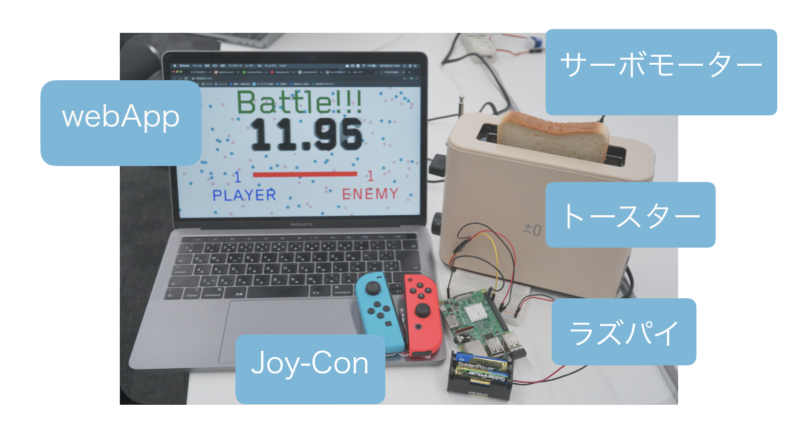

## 概要
- [HackDay](https://hackday.jp/) に参加したときの作品。
- ジョイコンとトースター、ラズパイを使っています。
- 開発環境：web(Flask)
- 担当箇所：webプログラム全般

## 内容
- 二人でバトル形式でジョイコンを動かす。
- 勝敗が決まりより激しく動いたほうがトースターを食べることができる。

## ソースコード
- [GitHub](https://github.com/yuma1100/2020_hackday)
