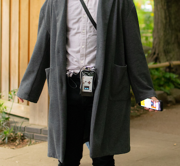
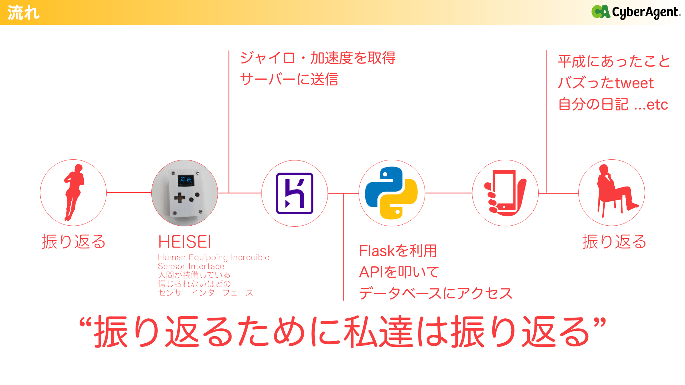

## 概要
- [平成最後のハッカソン](https://www.cyberagent.co.jp/careers/students/event/detail/id=22909)に参加したときの作品
- 開発環境：web(Flask)
- 担当箇所：フロントエンド・API作成・デモ動画作成
  

## 内容
- 物理的に振り返ることで、誰でも楽しく過去にあったことを振り替えることができる。
- 3Dプリンターとeps32からなるデバイス-HEISEI-から値を取得し、mqttを用いてサーバー側に送る。
- スクレイピングでデータベースに元々保存していた情報にAPIでアクセスをし、振り向いた向き、速さなどの条件から携帯に表示する情報を変更しています。

## デモ動画
- https://vimeo.com/333354788

## ソースコード
- web側：[GitHub](https://github.com/oita-kosen/look_back_HEISE)
- ハード側：[GitHub](https://github.com/oita-kosen/Human-Equipping-Incredible-SEnsor-Interface)

## 公開サイト
- https://look-back-heisei.herokuapp.com/