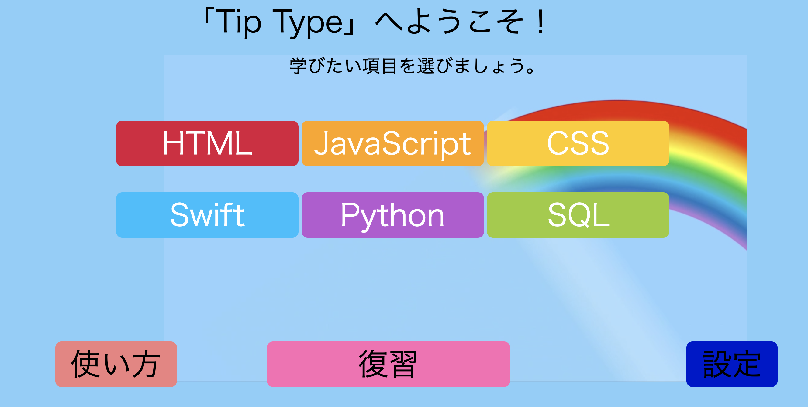

## 概要
- [Hack U Tokyo](https://hacku.yahoo.co.jp/hacku2019tokyo/)  に参加したときの作品。
- 開発環境：web
- 担当箇所：webプログラム全般・採点システムの構築

## 内容
- タイピングゲームをしながらプログラミングの構文を覚えるアプリ
- 計算などが可能である言語に関しては競技プログラミングのようなシステムを導入し、実際にプログラミングを書いてみるというものにした。

## ソースコード
- [GitHub](https://github.com/hacku-jokers/typing_game)
  
## デモ動画
- https://vimeo.com/354445841
